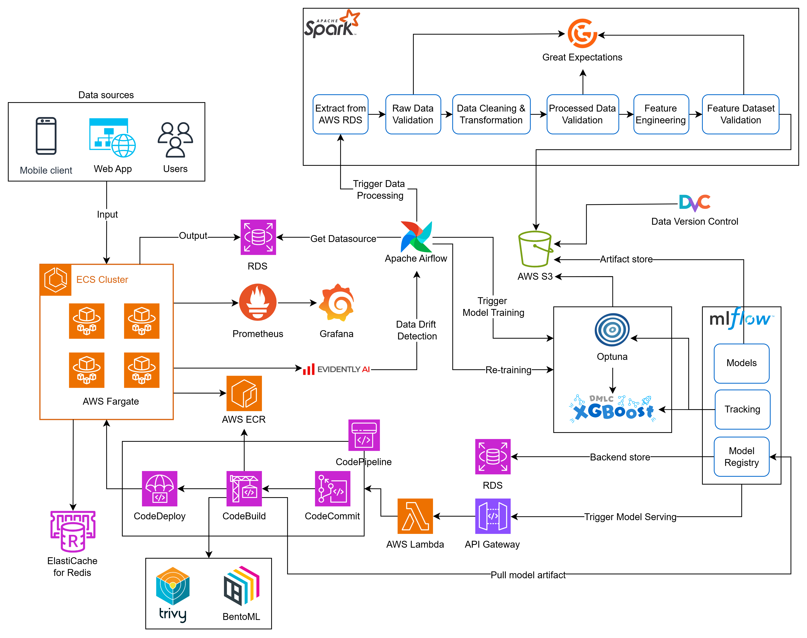

# MLOps Project - Deploy a MLOps Pipeline for Machine Learning of Fraud Detection



## Phase 1: Data Processing

**Life cycle of Phase 1:**

```
Kaggle Dataset (cold start)
        ↓
  Train Model v1
        ↓
  Deploy → Nhận giao dịch thực từ user
        ↓
  Giao dịch thực + Prediction của model → lưu lại
        ↓
  Data Processing (batch) → Dataset mới
        ↓
  Dataset cũ + Dataset mới = Dataset lớn hơn
        ↓
  Train lại Model v2
        ↓
  (lặp lại...)
```

Tuy nhiên có một điểm quan trọng cần lưu ý: Kết quả model trả về (predicted_fraud = 0 hoặc 1) không thể tự động trở thành label cho training về sau. Vì nếu model v1 dự đoán sai mà ta lấy cái sai đó làm label để train v2, model sẽ ngày càng tệ hơn - đây gọi là label feedback loop / training on noisy labels.

Giải pháp thực tế cho đồ án: Trong thực tế người ta có nghiệp vụ review lại (human-in-the-loop), nhưng với đồ án, ta có thể đơn giản hóa bằng cách giữ nguyên label gốc từ Kaggle và simulate label cho data mới theo tỉ lệ fraud thực tế (~0.17%) kèm các đặc trưng bất thường - tương tự ý tưởng ban đầu của ta. Đây là cách tiếp cận hợp lý và honest về mặt học thuật.

**Datasources là gì và lưu ở đâu:**

Khi model được deploy, mỗi lần user gửi thông tin giao dịch lên API, hệ thống sẽ:

1. Gọi model → nhận kết quả
2. Ghi lại cả input + output vào một nơi lưu trữ (AWS RDS PostgreSQL)

```
User gửi giao dịch
    → FastAPI / Model Serving
    → Trả kết quả cho user
    → Ghi vào RDS: {transaction_data + predicted_label + timestamp}
```

**Workflow chi tiết:**

**Step 0 - Cold Start**

- Tải Kaggle dataset về, xử lý thủ công một lần, lưu vào S3 làm baseline dataset.
- Đây là dataset dùng cho lần training đầu tiên (Model v1).

**Step 1 - Airflow DAG: batch_data_pipeline (chạy hàng ngày/tuần)**

```
Task 1: extract_from_rds
    → Query RDS lấy toàn bộ giao dịch mới kể từ lần chạy trước
    → (dùng Airflow Variable lưu "last_processed_timestamp")
    → Lưu tạm ra file CSV/Parquet trên EC2

Task 2: validate_raw_data
    → Great Expectations kiểm tra schema, null, range
    → Fail → gửi alert (Slack/email), dừng pipeline

Task 3: clean_and_transform
    → PySpark (local mode) hoặc Pandas nếu data nhỏ:
        - Xử lý missing values
        - Loại duplicate
        - Chuẩn hóa timestamp
        - Encode categorical

Task 4: validate_processed_data
    → Great Expectations kiểm tra lần 2
    → Fail → alert, dừng

Task 5: feature_engineering
    → Tính: amount_zscore, tx_count_1h, is_night_hour, is_international
    → Lưu feature dataset

Task 6: validate_features
    → Kiểm tra không có feature constant, không có NaN
    → Fail → alert

Task 7: merge_with_existing_dataset
    → Tải existing dataset từ S3
    → Concat với batch mới
    → Lưu lại vào S3 dưới dạng versioned:
        s3://bucket/datasets/v1/, v2/, v3/...
    → Lưu metadata: số record, tỉ lệ fraud, ngày xử lý

Task 8: trigger_retraining (optional)
    → Nếu dataset mới đủ lớn (ví dụ tăng thêm >5%)
    → Gửi signal để trigger training pipeline
```