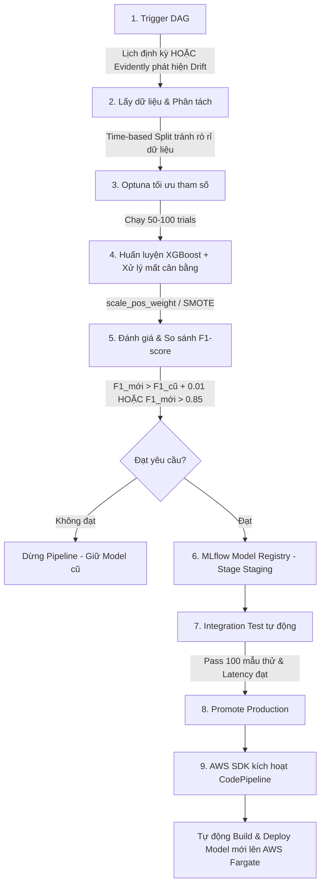

# HƯỚNG DẪN LUỒNG HOẠT ĐỘNG & KẾT QUẢ ĐÃ ĐẠT ĐƯỢC (GIAI ĐOẠN 2 - MODEL TRAINING)

## I. TỔNG HỢP CÁC KẾT QUẢ ĐÃ ĐẠT ĐƯỢC

1. **Cấu hình môi trường Python Local tương thích Python 3.14 (Windows)
   * Đã cấu hình thành công các thư viện: `xgboost`, `optuna`, `mlflow`, `scikit-learn`, `psycopg2-binary` (kết nối Postgres), và `boto3` (kết nối S3/MinIO).
   * Cung cấp tệp [requirements.txt](file:///d:/Download%20From%20Internet/MLops_DA/NT114-MLOps-Project/requirements.txt) để cài đặt nhanh.

2. **Dựng cụm MLflow Server chạy thử độc lập (Sandbox):**
   * Viết tệp cấu hình [docker-compose.mlflow.yaml](file:///d:/Download%20From%20Internet/MLops_DA/NT114-MLOps-Project/docker-compose.mlflow.yaml) chạy 3 dịch vụ chính:
     * **Postgres (`mlflow_postgres` - cổng 5433):** Lưu trữ lịch sử huấn luyện, tham số, điểm số (metadata).
     * **MinIO (`mlflow_minio` - cổng 9000/9001):** Giả lập AWS S3 để lưu tệp mô hình (artifacts) dưới local.
     * **MLflow Server (`mlflow_server` - cổng 5000):** Giao diện Web UI quản lý mô hình (phiên bản `latest`).

3. **Tích hợp đồng bộ vào hệ thống chính:**
   * Tích hợp thành công các dịch vụ MLflow ở trên vào tệp cấu hình chính của dự án [docker-compose.yaml](file:///d:/Download%20From%20Internet/MLops_DA/NT114-MLOps-Project/docker-compose.yaml). Khi chạy dự án thật, toàn bộ dịch vụ (Airflow, Redis, Postgres, MLflow, MinIO) sẽ tự động khởi chạy cùng nhau.

4. **Tập lệnh kiểm thử & Xác thực thành công:**
   * Viết tệp [test_mlflow.py](file:///d:/Download%20From%20Internet/MLops_DA/NT114-MLOps-Project/test_mlflow.py) chạy thử luồng huấn luyện mẫu:
     * Tạo dữ liệu giả lập mất cân bằng (0.17% fraud).
     * Dùng Optuna chạy 15 vòng thử nghiệm (trials) để tìm tham số tốt nhất cho XGBoost.
     * Huấn luyện mô hình XGBoost tốt nhất, tự động đẩy lên MinIO và đăng ký phiên bản `v1` của mô hình `CreditCardFraudModel` trên MLflow Model Registry thành công.

---

## II. LUỒNG HOẠT ĐỘNG CỦA GIAI ĐOẠN 2 (MODEL TRAINING)

Khi hệ thống đi vào hoạt động thực tế trên Airflow, luồng huấn luyện sẽ tự động vận hành qua 9 bước sau:

### Chi tiết ý nghĩa từng bước:
1. **Trigger (Kích hoạt):** Airflow DAG `model_training` chạy theo lịch hàng tuần/tháng hoặc tự động chạy ngay lập tức khi **Evidently AI** phát hiện hành vi người dùng thay đổi làm lệch phân phối dữ liệu (Data Drift).
2. **Lấy & Phân tách dữ liệu:** Kéo tập đặc trưng (Feature Dataset) từ S3. Chia dữ liệu theo thời gian (`Time`): dữ liệu cũ dùng để học (Train), dữ liệu mới dùng để kiểm thử (Test) nhằm tránh rò rỉ thông tin tương lai (Data Leakage).
3. **Optuna tối ưu tham số:** Chạy 50 - 100 trials, tự động chọn ra bộ tham số (learning_rate, max_depth, n_estimators...) giúp mô hình đạt điểm **F1-score** cao nhất trên tập Validation.
4. **Xử lý mất cân bằng:** Do giao dịch gian lận cực kỳ ít (chỉ 0.17%), XGBoost được cấu hình tham số `scale_pos_weight` (ví dụ phạt lỗi sai của lớp gian lận nặng gấp 400 lần bình thường) giúp mô hình tập trung học các ca gian lận.
5. **So sánh F1-score:** So sánh điểm F1-score của mô hình mới với mô hình đang chạy thực tế (Production).
   * **Điều kiện thăng cấp:** F1 mới > F1 cũ + 0.01 **HOẶC** F1 mới > 0.85.
   * Nếu không đạt: Hủy bỏ, giữ nguyên mô hình cũ.
6. **Đăng ký mô hình (Staging):** Nếu đạt điều kiện, đăng ký mô hình vào MLflow Model Registry dưới trạng thái **`Staging`**.
7. **Kiểm thử tích hợp (Integration Test):** Gửi thử 100 giao dịch mẫu xem mô hình có trả về kết quả đúng định dạng JSON không và độ trễ phản hồi (latency) có đạt yêu cầu dưới mili-giây không.
8. **Thăng cấp lên Production:** Mô hình được chuyển trạng thái sang **`Production`** trong Registry.
9. **Kích hoạt Deploy tự động:** Airflow gọi thư viện `boto3` kích hoạt **AWS CodePipeline** để tự động build BentoML image và deploy mô hình mới lên cụm server AWS Fargate thực tế.

---

## III. KẾT QUẢ HUẤN LUYỆN THỰC TẾ (COLD START) ĐẠT ĐƯỢC

Sau khi đưa tệp dữ liệu thật `creditcard.csv` vào hệ thống, chúng ta đã chạy huấn luyện thành công bằng tệp `train_real_data.py`. Dưới đây là các thông số thực tế đạt được:

* **Quy mô tập dữ liệu:** 284,807 dòng.
  * Phân tách thời gian (80/20): Tập Train (227,845 mẫu, 417 Fraud) và tập Test (56,962 mẫu, 75 Fraud).
  * Tỷ lệ mất cân bằng dữ liệu gốc: 1 ca Fraud / ~545 ca giao dịch bình thường.
* **Tối ưu siêu tham số (Optuna):** Chạy 15 trials và tự động tìm ra bộ siêu tham số tối ưu nhất cho XGBoost:
  * `max_depth` (độ sâu cây): 6
  * `learning_rate` (tốc độ học): 0.1517
  * `n_estimators` (số cây): 115
  * `scale_pos_weight` (trọng số lớp thiểu số): 363.84
* **Hiệu năng của mô hình tốt nhất (F1-score = 0.8175):**
  * **Precision (Fraud):** 0.90 (90% dự đoán gian lận là chính xác).
  * **Recall (Fraud):** 0.75 (Phát hiện thành công 75% số ca gian lận thực tế).
* **Trạng thái lưu trữ:**
  * Metadata và tham số lưu trữ thành công trong Postgres DB.
  * Model artifacts lưu trữ thành công trong MinIO S3 Mock.
  * Đăng ký thành công thành phiên bản **`Version 2`** của mô hình `CreditCardFraudModel` trên MLflow Model Registry.
